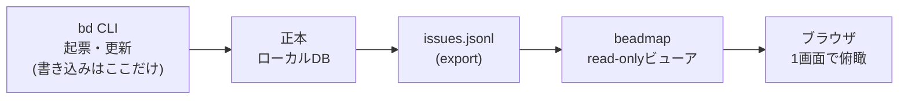

## 結論

CLIタスク管理ツール beads のタスクを1画面で俯瞰する、読み取り専用ビューア [beadmap](https://github.com/syotakokichi/beadmap) を作って公開しました。

installせずに触れる静的デモも用意しています。
この連載で作っている社内精算デモ基盤 [settlebase](https://github.com/syotakokichi/settlebase) の実際のタスク進捗が、ブラウザだけで見られます。

https://syotakokichi.github.io/beadmap/

作ってみて一番伝えたいことを先に書くと、こうなります。

**進捗の見える化は画面レイアウトの問題ではなく、「正本を壊さない構造」の問題。read-onlyは「気をつける」ではなく、構造とテストで保証する。**

## この記事とシリーズについて

シリーズ「企業でAIを安全に使って業務システムを作る」では、公開デモサービス settlebase を実際に作りながら、AIを使う開発の設計と運用を記録しています。
本記事はその開発を支えている道具側の話——タスク管理の「俯瞰」を自作した記録です。

## 課題: AIと開発すると、タスクは増える。全体像は見えなくなる

AIエージェントと開発を進めると、タスクの粒度は細かく、量は多くなります。
思いついたことをすぐ起票できるうえ、エージェント自身も作業中に「これは別タスクにすべき」と次々に起票してくるからです。

タスク管理には beads([bd CLI](https://github.com/gastownhall/beads))を使っています。
issueをローカルDBで管理するCLIツールで、起票・更新・依存関係・「いま着手できるタスク」の判定(`bd ready`)など、個々のタスク操作はCLIだけで十分に速い。

ただ、使い込むほど「全体」が見えなくなりました。

- 全体でどこまで進んだのか
- いま何が詰まっていて、何から着手できるのか
- 起票したまま、静かに止まっているタスクはどれか

`bd list` や `bd ready` の出力は「一覧」であって「地図」ではありません。
一覧は見える。全体像が見えない。
これが beadmap の出発点です。

## UIで俯瞰すると、何が変わったか

### 1. 停滞が、開いた瞬間に目に入る

進行中のタスクは「更新が古い順」に並べました。
一番上に来るのは、一番長く動いていないタスクです。

タスク管理で怖いのは、忙しく動いているタスクではなく、静かに止まっているタスクです。
更新が新しい順に並べると、活発なものばかりが目に入り、止まっているものは下に沈みます。
並び順をひとつ逆にするだけで、「これ、止まってない?」が画面を開いた瞬間に分かるようになりました。

### 2. 親子と依存が「一段先まで」見える

上部のサマリータイル(進行中 / 着手可能 / ブロック中 / open全体 / closed)をクリックしてビューを切り替え、epicは子タスクへ展開できます。
詳細ペインには、親・子・blocker(これが閉じるのを待っている)・依存元(このタスクを待っている)を一段先まで表示します。

依存関係の全体グラフを描画する案もありましたが、やめました。
実際に知りたいのは毎回「このタスクの前後」だけで、全体グラフは見た目が派手なわりに意思決定に使わないからです。

### 3. read-onlyだから、常時開いておける

後述するとおり beadmap は読み取り専用なので、開きっぱなしにしても何も壊れません。
30秒ごとに自動更新され、CLIで起票・更新した結果がそのまま画面に映ります。

「たまに集計して眺める」が「常に見えている」に変わると、定例の負荷が下がります。
実際に週次レビュー(閉じ漏れ確認 → backlogの棚卸し → 今週の着手選択 → 待ち状態の解除)をこのUIでやってみたところ、`bd list`・`bd ready`・`bd blocked` を行き来しながらやっていた突き合わせが、1画面で完結しました。

## 設計判断: 見える化ツールに、正本を書き換えさせない

ここが本記事の核です。

進捗の見える化ツールを作るとき、最初に決めるべきは画面レイアウトではなく「そのツールにデータを書かせるか」だと考えています。

ビューアに起票や更新の機能を足すと、便利になる代わりに2つの問題を持ち込みます。

- **正本を壊すリスク**: 書き込みのバグひとつで、タスク管理そのものが信用できなくなる
- **二重管理**: CLIとUIのどちらが正か、運用のたびに迷う

そこで beadmap はこう決めました。
**beadsが正本、beadmapは読み取り用の地図。地図は現地を書き換えない。**

ポイントは、これを「注意して運用する」のではなく、構造とテストで保証したことです。

| # | 契約 | 対応テスト |
|---|------|-----------|
| 1 | `127.0.0.1` にのみバインドする(外部公開の手段を持たない) | `TestListenLocalBindsLoopbackOnly` |
| 2 | GET以外のHTTPメソッドはすべて405で拒否する | `TestWriteMethodsRejected` |
| 3 | bd CLIの実行は読み取り専用の固定引数のみ。任意コマンドを組み立てない | `TestBDArgsAreFixed` |
| 4 | 外部サービスへの自動アクセスをしない(依存ゼロ・テレメトリなし) | `TestGoModHasNoDependencies` ほか |
| 5 | データ取得に失敗した時は、前回スナップショットを「古い」と明示して表示する | `TestStaleServesLastGoodSnapshot` |

AIにコードを書かせる前提だと、この形は特に効きます。
「書き込み機能は作らないでね」という指示は、拡張を重ねるうちにいつか破られます。
でも、**契約ごとにテストを置いておけば、契約を破る変更はCIで落ちます。**
テストを弱める変更は「契約の変更」として扱い、README の契約表と同時に更新して人間が承認する運用にしました。

### 正本とexportを区別し、鮮度を画面に書く

もうひとつの設計判断はデータソースです。

beadmapが読む `.beads/issues.jsonl` は、beads公式の位置づけで「viewer・相互運用向けのexport」であり、正本(ローカルDB)そのものではありません。
「正でないものを読んでいる」なら、それを画面に書くべきです。

- ヘッダーに常時表示: jsonlの更新時刻・取得時刻・readyの算出元
- bd CLIが使える環境では、ready / blocked をライブクエリで取得(こちらが正)
- bd が無い環境では jsonl の依存関係から近似計算にフォールバックし、**近似であることを画面に明示**
- 取得に失敗した時は、黙って最後のデータを見せ続けるのではなく「古い」と明示した上で見せる

見える化ツールの信頼性は「正しく見えること」ではなく、**どこまで信じていいかが画面に書いてあること**だと考えています。

### Goゼロ依存にした理由

実装はGo(標準ライブラリのみ)、外部依存ゼロの単一バイナリです。
UIも素のHTML/CSS/JSをバイナリに同梱(go:embed)していて、NodeもDBも要りません。
導入(`go install`)も起動も1コマンドです。

正直に書くと、Goはこの連載で初採用です。
デモ本体のsettlebaseはNext.js + Supabaseで作っているので、同じスタックに揃える案も当然ありました。
それでも分けたのは、**「アプリ」と「開発補助ツール」では最適解が違う**と判断したからです。

| 候補 | 見送った理由 |
|------|-------------|
| Next.js(デモ本体と同スタック) | ビューア1画面に対して依存とビルドが過剰。node_modulesの保守がツールの保守になる |
| Node/TS + Express | 書き慣れてはいるが、依存ゼロにはならず実行にNodeランタイムが要る |

開発補助ツールは「あると便利」の道具です。
導入が重い・ビルドが要る・依存の脆弱性対応に追われる——そうなった瞬間に、俯瞰したい時にサッと開く道具としては使われなくなります。
常時起動しておくものなので、機能の多さより「導入が一瞬で、動き続けて、攻撃面が増えない」ことを優先しました。
依存ゼロは好みではなく契約で、read-only契約の表の#4としてテストで固定してあります。
後から誰か(未来の自分やAI)が安易にライブラリを足しても、その変更はCIで落ちます。

もうひとつ、AIにコードを書かせる文脈で効いた副産物があります。
Goの明示的で冗長なコードは、フレームワークの暗黙の挙動がないぶん「何が起きるかがコードに全部書いてある」状態になり、**AIの成果物を人間がレビューしやすい**のです。
初採用の学習コストは、規模を小さく保つこと(3層・1画面)で抑えました。

## 実際に触れる: 静的デモ

冒頭にも書いたとおり、install不要の静的デモを公開しています。

https://syotakokichi.github.io/beadmap/

- settlebase(この連載のデモ基盤)と beadmap 自身の実タスクを切り替えて俯瞰できます
- beadmap のタスクも beadmap で見る、という自己言及構成です(ドッグフーディング)
- データは毎日自動更新されます。公開リポジトリの公開データだけを入力に、公開してよい内容かを検査するゲートを通過した時だけ反映される仕組みです(この「安全ゲートの自動化」は別記事で書きます)

## まとめ

1. **一覧と地図は別物**。CLIタスク管理に足りないのは操作ではなく俯瞰で、「停滞が目に入る並び」だけでも道具を作る価値があった
2. **ビューアのread-onlyは、構造とテストで保証する**。「作らないでね」という指示は破られるが、契約テストは破る変更をCIで落とす
3. **データの鮮度と算出元を画面に書く**。「どこまで信じていいか」を見せることが、見える化ツールの信頼性になる

## おわりに

beadmap の設計判断(ADR)と時系列の開発記録(devlog)は、[リポジトリ](https://github.com/syotakokichi/beadmap)にそのまま公開しています。
「なぜread-onlyにしたか」「静的デモをどう組み立てたか」の一次記録は、記事と突き合わせて読めます。

次回は、この開発で公開直前に実際に効いた「境界ゲート」——公開してはならない情報の混入を、push前に機械検査で止める仕組み——について書く予定です。

参考になれば嬉しいです。

## 連載一覧

1. [AI駆動開発で社内精算デモ基盤を1日で公開するまでの実録](https://zenn.dev/syommy_program/articles/settlebase-launch-devlog)
2. [AIにコードを書かせる時代のSupabase RLS——マルチテナント境界をpgTAPとCIで守る実録](https://zenn.dev/syommy_program/articles/settlebase-tenant-boundary)
3. AI開発でタスクは増える、全体は見えない——beads俯瞰ビューア自作の実録(本記事)
4. 第4弾以降: 準備中(公開後にここへリンクを追記します)
