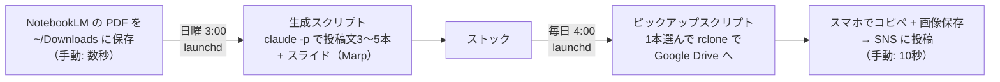
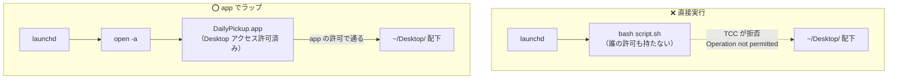

## 結論

launchd から Desktop 配下のシェルスクリプトを直接実行するのはやめて、
**AppleScript app にラップして `open -a` で起動する**構成にしたら安定しました。

macOS のセキュリティ機構（TCC）は launchd から直接起動されたプロセスに厳しく、
`.app` には権限を付与しやすいからです。

## やりたかったこと

毎日の SNS 発信を自動化するパイプラインを Claude Code CLI で作っていました。



人間がやるのは「PDF を置く」と「スマホから投稿する」だけ。
手動実行では完璧に動きます。

あとは launchd に登録して寝るだけ……というところで沼が始まりました。
スクリプトの置き場は `~/Desktop/` 配下のリポジトリです。
これが後で効いてきます。

## ハマり①: cron はフルディスクアクセスが必要

最初は cron を考えましたが、macOS では `/usr/sbin/cron` 自体にフルディスクアクセスを付与しないと保護ディレクトリに触れません。

システム全体に効く権限をデーモンに渡すのは避けたかったのと、
Apple が launchd を推奨していることもあり、LaunchAgent に切り替えました。

```xml
<key>ProgramArguments</key>
<array>
  <string>/bin/bash</string>
  <string>-c</string>
  <string>cd ~/Desktop/Vault && bash scripts/daily-pickup.sh</string>
</array>
<key>StartCalendarInterval</key>
<dict>
  <key>Hour</key><integer>4</integer>
  <key>Minute</key><integer>0</integer>
</dict>
```

## ハマり②: launchd から実行すると Operation not permitted

ところが launchd 経由だと動きません。
標準エラーに残っていたのは `Operation not permitted`。
手動なら動くのに、です。

原因は **TCC（Transparency, Consent, and Control）** でした。
macOS では `~/Desktop` `~/Documents` `~/Downloads` などが保護対象で、
アクセスにはユーザーの明示的な許可が必要です。

- ターミナルから実行 → 「ターミナル.app に付与された許可」を継承して動く
- launchd から直接起動された bash → **誰の許可も持っていない**

スクリプトが `~/Desktop/` 配下にある時点で、
`cd` した先のファイルを読むところからアウトでした。

## ハマり③: ./script.sh 直接実行と com.apple.provenance

権限を整えても、まだ動かないケースが残りました。
`xattr` でスクリプトを見ると、`com.apple.provenance` という拡張属性が付いています。

```bash
$ xattr ~/Desktop/Vault/scripts/daily-generate.sh
com.apple.provenance
```

これは macOS がファイルの「出どころ」を追跡するための属性で、
`./scripts/daily-generate.sh` のように**実行ファイルとして直接起動すると弾かれる**ことがありました。
`bash scripts/daily-generate.sh` のように bash への引数として渡すと通ります。

この挙動の内部仕様は公開されていないため観察ベースの理解ですが、
「直接実行はダメで、インタプリタ経由なら通る」という差は再現性がありました。
同じ構成でハマったら、まず plist の起動コマンドを `bash 〜` 形式に変えてみてください。

## 解決: AppleScript app でラップする

権限をひとつずつ足していくモグラ叩きに疲れて、発想を変えました。

**TCC の権限管理は「.app 単位」が基本**です。
なら、app にしてしまえばいい。

手順は3つです。

**1. AppleScript を app として保存する**

Script Editor で以下を書いて、フォーマット「アプリケーション」で `~/Applications/DailyPickup.app` に保存します（`osacompile` でも作れます）。

```applescript
do shell script "export PATH=/opt/homebrew/bin:/usr/local/bin:/usr/bin:/bin && export HOME=/Users/you && export VAULT=/Users/you/Desktop/Vault && cd $VAULT && bash scripts/daily-pickup.sh >> scripts/logs/daily.log 2>&1"
```

**2. app を一度手動で起動して、権限を許可する**

初回起動時に「DailyPickup.app が Desktop 内のファイルにアクセスしようとしています」というダイアログが出るので許可します。
必要に応じてシステム設定からフルディスクアクセスにも追加します。

**3. plist は app を開くだけにする**

```xml
<key>ProgramArguments</key>
<array>
  <string>open</string>
  <string>-a</string>
  <string>/Users/you/Applications/DailyPickup.app</string>
</array>
```

こうすると TCC から見て「DailyPickup.app が Desktop にアクセスする」という分かりやすい構図になり、
一度許可すればずっと安定して動きます。



## 細かい注意点

- **PATH と HOME は自前で通す**
  launchd や `do shell script` の実行環境はほぼ空です。
  Homebrew のパス（`/opt/homebrew/bin`）も CLI ツールの場所も、上の例のように自分で export します
- **スクリプト側は環境変数を上書き可能にしておく**
  `VAULT="${VAULT:-$(cd "$(dirname "$0")/.." && pwd)}"` のようにデフォルト付きで受けると、app 経由でも手動でも同じスクリプトが動きます
- **ログは最初に仕込む**
  launchd のデバッグは標準出力が見えないと苦しいです。
  plist の `StandardOutPath` / `StandardErrorPath` と、スクリプト側のログ追記を先に用意しておくと、沼の深さが半分になります

## セキュリティ上の注意点

この構成は「TCC の壁を app で越える」ワークアラウンドなので、
越えた先の責任も自分で持つ必要があります。

- **フルディスクアクセスは最後の手段にする**
  まずは初回ダイアログで出る「Desktop フォルダへのアクセス」など、フォルダ単位の許可だけで動くか試してください。
  フルディスクアクセスを与えた app は、`do shell script` で実行するコマンドごとディスク全体を読めるようになります
- **app とスクリプトの連鎖は「自動で任意コードが動く経路」になる**
  plist → app → シェルスクリプトと辿って、最終的に動くのはリポジトリ内のスクリプトです。
  ここに悪意あるコードが混ざれば毎日自動実行されます。
  リポジトリの pull を自動化する場合や、他人の PR を取り込む運用では特に注意してください
- **TCC の許可は app 単位に紐づく**
  app を作り直したら許可も付け直しです。
  許可の棚卸しは「システム設定 → プライバシーとセキュリティ → ファイルとフォルダ / フルディスクアクセス」でいつでも確認・取り消しできます
- **認証情報をログに残さない**
  パイプラインで使う CLI（claude、rclone 等）の認証情報が、export した環境変数ごとログへ流れないように、
  スクリプト内で `set -x` を使う場合は特に気をつけてください

## まとめ

- macOS の定期実行で保護ディレクトリ（Desktop 等）を触るなら、TCC を前提に設計する
- launchd から直接シェルスクリプトを叩く構成は権限管理がつらい。**AppleScript app + `open -a` のラップが素直**
- `com.apple.provenance` で直接実行が弾かれたら、`bash script.sh` 形式に変える
- PATH / HOME とログを最初に整えると調査がずっと楽になる
- app に与えた権限の範囲と、自動実行されるコードの管理は自分の責任で。フルディスクアクセスは最後の手段に

同じところでハマる方の参考になれば嬉しいです。
