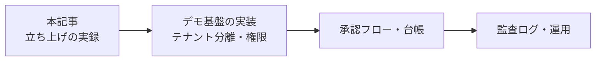
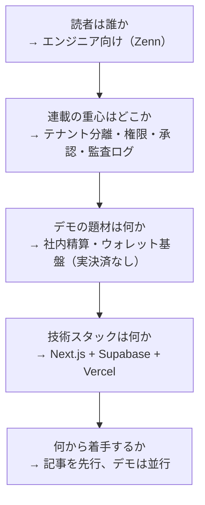
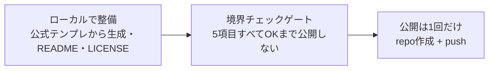

## 結論

構想だけの状態から1日で、マルチテナントの社内精算・ウォレットデモ基盤 [settlebase](https://github.com/syotakokichi/settlebase) を公開URLまで立ち上げました。

といっても、1日でできたのは器(リポジトリ・開発の土台・公開デプロイ)までです。
精算機能の中身はこれから作ります。

この記事はその過程の実録です。
企画の詰め方から公開前のチェック、デプロイまで、実際の判断をそのまま書いています。

やったことを一言でまとめると、こうなります。

**作るのはAI、決めるのは人間。そして公開の前には必ずゲートを置く。**

## この記事とシリーズについて

AIにコードを書かせること自体は、もう難しくありません。
難しいのは、業務システムに求められる「安全側の設計」——テナント分離、権限、承認フロー、監査ログ——を、AIを使いながらどう担保するかです。

シリーズ「企業でAIを安全に使って業務システムを作る」では、公開デモサービス settlebase を実際に作りながら、そのやり方を記録していきます。
本記事はその立ち上げ編です。
仕事で作ったものは記事に出せないので、コードも過程も全部見せられる自作デモを題材にしています。



## Day 0: 出発点は「構想だけ」

スタート時点にあったのは、「実践してきたAI開発の進め方を連載にしたい。題材のデモサービスを作ろう」という構想だけでした。

このとき最初に決めたのは、意外かもしれませんが「記録の仕組み」です。

途中の判断や試行錯誤は、後から思い出して再現できません。
そこで devlog(時系列の開発記録)と ADR(意思決定の記録)を初日から書くことを、立ち上げの要件に含めました。

もうひとつ、本業（決済ドメイン）の経験を安全に活かすためのルールも先に決めました。
本業のコードや資料は公開物に一切持ち込まず、「一般化した設計パターンのメモ」だけを経由させるという分離です。

## Step 1: 企画を1問ずつ詰める

最初にやったのは、AIとの壁打ちで企画を固めることです。

ただし「いい感じに企画を考えて」とは頼みません。
**1問ずつ質問させて、自分が答える**形にしました。

このとき使った自作プロンプトの型がこちらです。

```text
これから作るものの企画を詰めたいです。
次のルールでヒアリングしてください。

- まず、いま分かっている前提を3行以内で要約する
- 未決事項を「決めないと次が決められない」順に並べる
- 質問は一度に1つだけ。各質問には推奨回答とその理由を添える
- 私の回答を受けてから、次の質問に進む
- すべて決まったら、決定事項・保留・次アクションを短くまとめる
```

ポイントは「推奨回答を添えさせる」ことです。
ゼロから考えるのではなく、推奨案に Yes/No で反応すればいいので、判断が速くなります。

質問は自然と、こういう順番の決定木になりました。



題材を社内精算・ウォレット基盤にしたのは、承認フローや台帳といった連載の重心に正面から当たり、かつ本業(決済ドメイン)の得意分野だからです。
勘所の分かる領域なら、AIの出力の良し悪しを自分で判断できます。

振り返って一番効いたのは、**技術スタックを最後に決めた**ことです。
読者と重心が決まっていないと、題材もスタックも選びようがない。
逆に言うと、先にスタックから入ると、企画が技術都合に引っ張られます。

## Step 2: 計画を独立レビューにかける

企画が決まったら、立ち上げ作業の計画を立て、実装前にレビューを挟みました。

レビューは1つのAIに「どう思う?」と聞くのではなく、観点を分けた3系統(事実・リスク / スコープ / 粒度)に独立で見せる形にしています。

このレビューで計画が2つ修正されました。

- スコープを「器(リポジトリと土台)だけ」に絞り、画面のUI設計は別タスクに分離
- 公開前のチェックを、後述する5項目の「ゲート」として明文化

特に2つ目は、あとで効いてきます。

## Step 3: AIが案を出し、人が決める

立ち上げの途中には、正解がなく好みで決まる分岐がいくつも出てきます。
こうした分岐はAIに決めさせず、**AIが案を出し、人が決める**形に固定しました。

名前決めはその典型です。
AIに系統の違う4案を出させ(GitHub・npm・Web検索の衝突確認つき)、人間が **SettleBase** を選びました。
初期候補のうち2案は衝突チェックで引っかかり、比較の場に出る前に差し替えられています。

ディレクトリ構成は逆に、AIの1案に人間が赤入れする形です。
「アプリ都合のファイルと docs が同列で見づらい」という赤入れで、アプリを `web/` に隔離した構成に変わりました。
実装前の紙の上の修正なので、手戻りはゼロです。

## Step 4: 境界チェックゲートを通して一発公開

公開の手順は、最初からこう固定していました。



GitHubリポジトリは作成した時点で名前も説明も公開されます。
だから「作ってから整える」のではなく、「ローカルで整えてゲートを通し、公開操作は最後に1回だけ」という順序にしました。

ゲートの中身は5項目です。

| # | チェック |
|---|---------|
| 1 | 禁止語(本業関連の固有名詞リスト)が全ファイルで grep 0件 |
| 2 | コード・プロンプトがすべて自作 |
| 3 | スクリーンショットが自分の環境・自作物のみ |
| 4 | コミュニティ投稿・チャットの引用なし |
| 5 | 有料コンテンツの構成をなぞっていない |

AIに依頼するときは、こういう指示にしています。

```text
公開前の境界チェックをしてください。
全項目OKになるまで、公開につながる操作は一切行わないでください。

1. 禁止語リスト（非公開ファイルで管理）の語が、公開対象の
   全ファイルで0件であることを grep で確認する
2. コード・プロンプトがすべて自作であることを確認する
3. 画像が自分の環境・自作物のみであることを確認する
4. コミュニティ投稿・チャットからの引用がないことを確認する
5. 有料コンテンツの構成をなぞっていないことを確認する

結果はチェックリストとして記録に残してください。
```

ゲートを通過してから `gh repo create --public` で公開。
公開操作はこの1回だけです。

## Step 5: 土台の仕組みとデプロイ — 最後の操作は人間に残す

公開した初日のうちに、開発を支える土台も同梱しました。

- devlog(時系列の記録)と ADR(意思決定の記録)
- GLOSSARY(用語集。定義と「使わない言い方」をセットで)
- 検証CI(リンク切れチェック + markdownlint)

そして Supabase と Vercel をつないでデプロイです。
ここで面白いことが起きました。

本番デプロイのコマンドは、AI側の権限設定で実行できずに止まり、最終的に人間が実行しました。
これは不便ではなく、むしろ意図どおりです。
**デプロイのような不可逆な操作は、人間の権限ゲートとして残す**方が安心して任せられます。

公開URLはこちらです(現時点では認証付きテンプレートの初期画面まで。中身はこれから作ります)。

https://settlebase-sandy.vercel.app

## 1日で得た3つの学び

1. **公開順序は「ローカル整備 → ゲート → 公開1回」が安全**。作ってから消すのではなく、出る前に止める
2. **CLIツールは一時ファイルを予期しない場所に作ることがある**。gitignore で保険をかけておく
3. **不可逆な最終操作は人間に残す**。AIの権限を全開にしないことが、安心して任せる条件になる

## おわりに: この「器」の上に何を作るか

今回立ち上げたのは、あくまで器までです。

次回以降、この器の上にマルチテナント分離・権限・承認フロー・監査ログを実装しながら、「企業でAIを安全に使う」ための設計と失敗パターンを書いていきます。

過程の一次記録(devlog / ADR)は [リポジトリ](https://github.com/syotakokichi/settlebase)で公開しているので、記事と突き合わせて読めます。

参考になれば嬉しいです。

## 連載一覧

1. AI駆動開発で社内精算デモ基盤を1日で公開するまでの実録(本記事)
2. 第2弾以降: 準備中(公開後にここへリンクを追記します)
