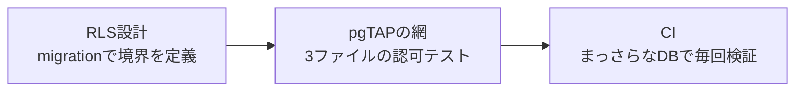

## 結論

[前回](https://zenn.dev/syommy_program/articles/settlebase-launch-devlog)は、マルチテナントの社内精算デモ基盤 [settlebase](https://github.com/syotakokichi/settlebase) を公開URLまで立ち上げました。
今回はその器の上に、テナント境界を守る小さな基盤——スキーマ → RLS → 認可テスト → CI の最小縦切り——を作りました。

マルチテナントの境界は、RLS（Row Level Security＝行レベルセキュリティ）を「書く」だけでは守れません。
**境界を破る変更が入ったら、機械的に検知されてCIが赤くなる網**まで作って、はじめて守れた状態になります。
この記事は、その網を作る過程でCIに前提の甘さを捕まえられて直し、最後に「わざと境界を破るPR」を出して網が止めることを確かめた実録です。

RLS自体の基礎知識は[Supabase公式ドキュメント](https://supabase.com/docs/guides/database/postgres/row-level-security)にまとまっているので、初めての方はそちらを先にどうぞ。

AIにコードを書かせる前提なら、この網は保険ではなく前提装備だと考えています。
まず、なぜそう言えるかからです。

## なぜ網が要るか: AIがやりがちな失敗パターン

AIが書くコードは、動くのに安全でないことがあります。

100以上のLLMを分析したVeracodeの [2025 GenAI Code Security Report](https://www.veracode.com/resources/analyst-reports/2025-genai-code-security-report/) では、生成されたコードサンプルの45%がセキュリティテストに失敗し、OWASP Top 10の脆弱性を混入しました。
また、主要LLMが生成したWebアプリコードを評価した[研究](https://arxiv.org/abs/2504.20612)は、認証・セッション管理・入力検証の不備を挙げ、「どのモデルも業界のベストプラクティスに完全には準拠しない」と結論しています。

マルチテナント境界に絞ると、やりがちなパターンはこの4つです。


| パターン                     | 何が起きるか                          |
| ------------------------ | ------------------------------- |
| tenant_id の条件漏れ          | アプリ層のwhere頼みだと、1箇所の漏れで他テナントが見える |
| RLSの張り忘れ                 | 新しいテーブルを追加したときに有効化を忘れる          |
| security_invoker offのビュー | ビューが作成者権限で実行され、RLSを素通りする        |
| 既定grantへの暗黙依存            | 環境によって権限の初期値が違い、挙動が変わる          |


どれも「コードは動く」ので、人間のレビューの注意力だけで毎回止めるのは無理があります。
だから、機械の網に受け止めさせます。

## 題材: 3テーブルの最小マルチテナント

settlebase（マルチテナントの社内精算デモ基盤）に、境界の最小縦切りを実装しました。
スキーマは tenants / members / wallets の3テーブルだけです。

```sql
create table public.tenants (
  id uuid primary key default gen_random_uuid(),
  name text not null
);

create table public.members (
  tenant_id uuid not null references public.tenants (id) on delete cascade,
  user_id uuid not null references auth.users (id) on delete cascade,
  primary key (tenant_id, user_id)
);

create table public.wallets (
  id uuid primary key default gen_random_uuid(),
  tenant_id uuid not null references public.tenants (id) on delete cascade,
  name text not null,
  balance bigint not null default 0
);
```

ゴールはひとつ。
**Tenant AのユーザーからTenant Bのデータが見えない・書けない。**

守りは三層にしました。




## RLS設計の実コード

RLSのmigrationがこちらです（[全文](https://github.com/syotakokichi/settlebase/blob/main/supabase/migrations/20260719025420_tenant_rls.sql)）。

```sql
-- 所属テナントの取得は security definer 関数に隔離する
create schema if not exists private;
grant usage on schema private to authenticated;

create or replace function private.user_tenant_ids()
returns setof uuid
language sql
security definer
set search_path = ''
stable
as $$
  select tenant_id from public.members where user_id = (select auth.uid())
$$;

alter table public.tenants enable row level security;
alter table public.members enable row level security;
alter table public.wallets enable row level security;

-- 権限は既定grantに依存せず、migrationで明示する
revoke all on public.tenants, public.members, public.wallets from anon, authenticated;
grant select on public.tenants, public.members, public.wallets to authenticated;
grant insert on public.wallets to authenticated;

create policy "wallets: 自テナントのみ参照" on public.wallets
  for select to authenticated
  using (tenant_id in (select private.user_tenant_ids()));
```

ポイントは3つです。

**1. 所属テナントの取得を security definer 関数に隔離**
security definer は「呼び出した人ではなく、関数の作成者の権限で動く」関数です。
ポリシー内でmembersを直接参照すると再帰評価になってしまうため、RLSの外側で所属を引ける関数に切り出します（Supabase公式の定石）。

**2. auth.uid() を `(select ...)` でラップ**
auth.uid() は「今ログインしているユーザーのID」を返す関数です。
素で書くと行ごとに毎回評価されるため、`(select ...)` で包んで評価を1回にします（公式推奨）。

**3. revoke all → 最小grantの明示**
grantは「そのテーブルにどの操作ができるか」という、RLS（どの行が見えるか）とは別レイヤーの権限です。
加算式なので、revokeで剥がさない限り既に付いた権限は残ります。
だから最初にすべて剥がし、必要な操作だけを付け直して既定値に依存しない状態にします（何も付いていない環境では空振りするだけで無害です）。
これが後で効いてきます。

## pgTAPで張る3枚の網

テストは[pgTAP](https://pgtap.org/)で3ファイル書きました（[テスト全文](https://github.com/syotakokichi/settlebase/tree/main/supabase/tests)）。
pgTAPは、テストをSQLそのもので書けるPostgreSQL用のユニットテスト拡張です。
DBの中の事実（RLSが有効か、この行が見えるか）を、DBの言葉のまま検査できます。

**001: 張り忘れを捕まえる全数検査**
核心はこの1本です。

```sql
select is(
  (select count(*)::int from pg_tables
    where schemaname = 'public' and rowsecurity = false),
  0,
  'public スキーマに RLS 無効のテーブルがない'
);
```

個別テーブルを列挙するテストだけだと、「新しいテーブルの張り忘れ」は検出できません。
「RLS無効のテーブルが0件」という全数検査にしておくと、未来に増えるテーブルにも網がかかります。

**002: テナント分離の実地検査**
テスト内でTenant A/Bの最小データを作り、認証セッションを再現して「見えない・書けない」の両方を確かめます。

```sql
-- alice（Tenant A）は Tenant B に wallet を作れない
select throws_ok(
  $$ insert into public.wallets (tenant_id, name)
     values ('10000000-0000-0000-0000-00000000000b', 'invasion') $$,
  '42501',
  null,
  'alice は Tenant B に wallet を作成できない（RLS 違反）'
);
```

**003: 危険実装の再現実験**
`security_invoker` は「ビューを実行者の権限で動かす」PostgreSQL 15以降のビューオプションです。
既定はoffで、ビューは作成者（owner）の権限で実行されます。
ownerはRLSの対象外になりうるため、offのままのビューはRLSを素通りします。

003ではこれを付け忘れたビューをわざと作り、Tenant Bがリークすることを実証した上で、`security_invoker = on` で塞がることまで確認します。
「何が危険か」をテストコード自体がドキュメントとして語ってくれます。

CIはGitHub Actionsで `supabase db start` → `supabase test db`。
まっさらなDBにmigrationを毎回適用してから、pgTAPを回します。

## 実録1: CIが前提の甘さを捕まえた

最初のPRで、002/003が `permission denied for table tenants` で落ちました。

原因はコードではなく前提です。
anon / authenticated は、Supabaseが標準で使うDBロールです（未ログイン=anon、ログイン済み=authenticatedの権限で実行される）。
このプロジェクトのホスティング環境では、新規テーブルを作るとこの2ロールへの広いgrantが自動で付いていました（この既定は[段階的な廃止が進行中](https://supabase.com/changelog/45329-breaking-change-tables-not-exposed-to-data-and-graphql-api-automatically)で、新しいプロジェクトでは明示grantが必須です）。
それを暗黙の前提にしていたため、既定grantのないまっさらなCI環境で露出しました。

対応が、先ほどの「revoke all → 最小grantの明示」です。
あわせて「anonはgrant自体がない（権限エラーになる）」ことをテストで仕様として固定しました。
権限をプラットフォームの既定に依存させない設計に直せたのは、まっさらなDBで毎回検証するCIの成果です。

## 実録2: わざと破って、網が止めることを確かめる

:::message
ここで見せる赤CIは、網の動作確認のために**意図的に境界を破ってみせた再現実験**です。
AIが自然に境界を破った記録ではありません。
:::

「新機能のテーブルを追加したが、RLSの有効化を忘れた」という、いちばん混入しやすい事故をデモPRで再現しました。

```sql
create table public.expense_reports (
  id uuid primary key default gen_random_uuid(),
  tenant_id uuid not null references public.tenants (id) on delete cascade,
  title text not null,
  amount bigint not null default 0
);

-- ここで alter table ... enable row level security と
-- ポリシー定義を「忘れて」いる
```

結果は想定どおり。
001の全数検査がこの変更を検出し、CIが赤になりました。


*デモPR。マージせずcloseし、証跡として残した*


*db-testsがfailした赤CI*


*落ちたのは「public スキーマに RLS 無効のテーブルがない」。001の網が検出した*

一次記録: [デモPR #2](https://github.com/syotakokichi/settlebase/pull/2) / [赤ラン](https://github.com/syotakokichi/settlebase/actions/runs/29674414074)
「境界を破る変更が入ったら、レビューアの注意力ではなくテストが落ちる」。
この状態を実際に確認できたので、安心してAIに実装を任せられます。

## AIに書かせるときのレビュー観点

最後に、AIにマルチテナントのコードを書かせるときの観点を1節に凝縮します。

- [ ] RLS有効化を全数検査するテスト（001相当）があるか
- [ ] 境界テストは「見えない」と「書けない」の両方を検査しているか（002相当）
- [ ] ビューに `security_invoker = on` が付いているか
- [ ] grantをmigrationで明示しているか（既定grant依存がないか）
- [ ] ポリシーのヘルパー関数は security definer + search_path 固定か
- [ ] CIはまっさらなDBでmigrationの適用から回しているか

順番は「まず001の網を張る」からで十分です。
網が1枚あるだけで、以降の張り忘れは全部そこに引っかかります。

## この記事とシリーズについて

シリーズ「企業でAIを安全に使って業務システムを作る」では、公開デモサービスsettlebaseを実際に作りながら、テナント分離・権限・承認フロー・監査ログといった安全側の設計を記録しています。
本記事の経緯・数値は一次記録（[devlog](https://github.com/syotakokichi/settlebase/blob/main/docs/devlog/2026-07-19-tenant-boundary.md) / PR / CI run）と照合した実話です。
コードの全文は[リポジトリ](https://github.com/syotakokichi/settlebase)で読めます。

参考になれば嬉しいです。

## 連載一覧

1. [AI駆動開発で社内精算デモ基盤を1日で公開するまでの実録](https://zenn.dev/syommy_program/articles/settlebase-launch-devlog)
2. AIにコードを書かせる時代のSupabase RLS——マルチテナント境界をpgTAPとCIで守る実録（本記事）
3. [AI開発でタスクは増える、全体は見えない——beads俯瞰ビューア自作の実録](https://zenn.dev/syommy_program/articles/beadmap-beads-viewer)
4. 第4弾以降: 準備中（公開後にここへリンクを追記します）

